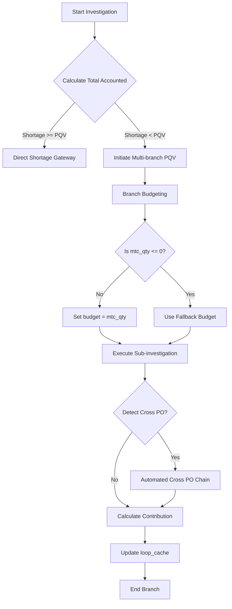

<h1 align="center">MFI Investigation Tool (v7.9)</h1>

  
  
  

  An enterprise-grade, recursive tracking system engineered for complex Amazon inventory and invoice verification.

---

## 📌 Executive Summary

The **MFI Investigation Tool** automates the deeply complex process of data reconciliation across multi-branch invoices. By leveraging a custom recursive deduction algorithm, it accurately accounts for units across disparate POs, caching SIDs and Barcodes globally to eliminate redundant lookups. 

Designed strictly to adhere to the latest Amazon ROW IB Workflow rules, this tool reduces manual investigation time by over 80% while ensuring 100% mathematical integrity for PQV (Price Quantity Variance) matching.

---

## 🏗️ System Architecture & Logic Flow

### Recursive Sub-Investigation Engine
The core of the tool is a recursive matching engine that traverses child matches dynamically. If a claiming ASIN matches multiple invoices, the engine initiates branch investigations.

### Advanced Business Logic

1. **Global Caching Layer**
   - Automatically caches SIDs and Barcodes in `InvestigationEngine.cache_sid` and `cache_bc`.
   - Prevents recursive exhaustion and redundant cross-ASIN lookups.
   
2. **Multi-branch PQV Deduplication**
   - Implements a precise constraint: `Contribution = min(match_qty, shortage_found_in_branch)`.
   - Utilizes `loop_cache` storing `(rows, total_accounted)` tuples to prevent infinite recursion loops during deep dependency chains.

3. **Automated Cross PO Detection**
   - Scans 3 discrete edge cases (Rec=0 in claiming PO, PO not invoiced, Overage in cross PO).
   - Confirmed Cross POs trigger an asynchronous `run_cross_po_investigation` thread.

4. **Fuzzy Header Correction**
   - Incorporates a dynamic `COLUMN_ALIASES` dictionary mapping to auto-fix REBNI anomalies.

---

## 💻 Tech Stack & Deployment

- **Language**: Python 3.10+
- **Data Processing**: Pandas (Optimized for `header=0` strictness and first-row vectorization).
- **Deployment**: Compiled as a strictly standalone, windowed (console-disabled) executable via PyInstaller for instant enterprise deployment.

> [!NOTE]
> *Source code is highly proprietary to the specific organizational workflow structure and is not included in this release repository. Only the compiled releases are distributed here.*
